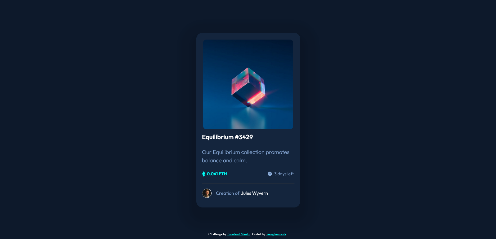

# Frontend Mentor - Product preview card component solution

This is a solution to the [Product preview card component challenge on Frontend Mentor](https://www.frontendmentor.io/challenges/product-preview-card-component-GO7UmttRfa). Frontend Mentor challenges help you improve your coding skills by building realistic projects. 

## Table of contents

  - [The challenge](#the-challenge)
  - [Screenshot](#screenshot)
  - [Links](#links)
  - [Built with](#built-with)
  - [What I learned](#what-i-learned)
  - [Continued development](#continued-development)
  - [Author](#author)


### The challenge

Users should be able to:

- View the optimal layout depending on their device's screen size
- See hover and focus states for interactive elements

### Screenshot




### Links

- Solution URL: [https://github.com/Jesug/nft-preview-card-component-main]
- Live Site URL: [https://jesug.github.io/nft-preview-card-component-main/]


### What I learned

```html
<div class="layer">
     <svg class="view" width="48" height="48" xmlns="http://www.w3.org/2000/svg"><g fill="none" fill-rule="evenodd"><path d="M0 0h48v48H0z"/><path d="M24 9C14 9 5.46 15.22 2 24c3.46 8.78 12 15 22 15 10.01 0 18.54-6.22 22-15-3.46-8.78-11.99-15-22-15Zm0 25c-5.52 0-10-4.48-10-10s4.48-10 10-10 10 4.48 10 10-4.48 10-10 10Zm0-16c-3.31 0-6 2.69-6 6s2.69 6 6 6 6-2.69 6-6-2.69-6-6-6Z" fill="#FFF" fill-rule="nonzero"/></g></svg>
</div>
```
```css
.layer {
  position: absolute;
  height: 290px;
  width: 290px;
  top: 20px;
  left: 20px;
  transition: 0.3s;
}

.layer:hover {
  background: rgba(0,255,247,0.7);
  border-radius: 10px;
}

.layer .view {
  position: absolute;
  top: 40%;
  left: 43%;
  opacity: 0;
  color: white;
  transition: 0.3s;
}

.layer:hover .view {
  opacity: 1;
}
```

### Continued development

I will definitely continue working on applying overlay to an image. While doing this project, it took a lot of time and researching to apply the background overlay over the nft image. It was worth the stress, seeing the final result.


## Author

- Frontend Mentor - [@Jesug][https://www.frontendmentor.io/profile/Jesug]
- Twitter - [@OmoniyiJesugbe1][https://twitter.com/OmoniyiJesugbe1]

